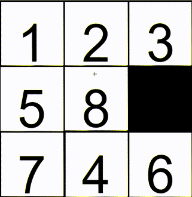

# Number Slider Puzzle
A simple 3x3 Number Slider Puzzle game based on OpenCV.

  
## Build requirements
1. CMake
2. OpenCV Release

  
## How to build

### Windows

```bash
cd build

# CMAKE_BUILD_TYPE can be Release or Debug
# OpenCV_DIR is the path to your OpenCV installation
cmake -G "MinGW Makefiles" -D CMAKE_BUILD_TYPE=Release -D OpenCV_DIR=<your_openCV_installation_path> ..

make
```
  
  It also supports MSVC.
  
## Additional
I don't work as a programmer, this is a learning-oriented project.
  
Enjoy.
